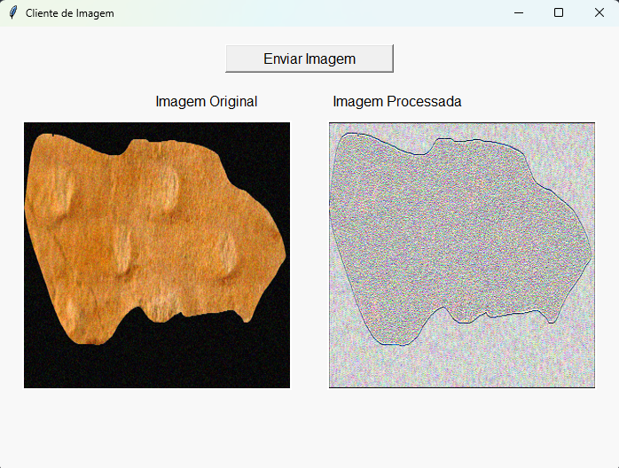

# Sistema Cliente-Servidor em Camadas

Projeto desenvolvido para a disciplina de Sistemas Distribuídos da UFPI, utilizando Python, Flask e SQLite para envio, processamento e exibição de imagens em um sistema cliente-servidor estruturado em três camadas.

---

## 🛠️ **Tecnologias Utilizadas**

- 🐍 **Python**
- 🌐 **Flask**
- 🖼️ **Pillow**
- 💾 **SQLite**
- 🧰 **Tkinter**
- 🖥️ **HTTP**

---

## 📥 **Como executar**

### 🔧 **Requisitos**

- ✅ **Python 3.8+**
- ✅ **Pip**

---

### 🖥 **Servidor**

### 1️⃣ **Clone o repositório**

```bash
git clone https://github.com/melissaoalves/layered-client-server.git
cd layered-client-server
```

### 2️⃣ **Crie um ambiente virtual**
```bash
pip install -r requirements.txt
```

### 3️⃣ **Execute o servidor**

```bash
python server/app.py
```

### 💻 **Cliente**

### 1️⃣ **Em outro terminal, execute:**

```bash
python client/client.py
```

### 2️⃣ **Clique no botão “Enviar Imagem” e selecione uma imagem do seu computador.**

### 3️⃣ **O servidor receberá, processará e retornará a imagem modificada, que será exibida ao lado da original.**

---

## 📸 _Prints da Interface_

### 🔹 _Interface Gráfica_



---

## 👨‍💻 **Autores**

**Davi Rodolfo e Melissa Alves**
